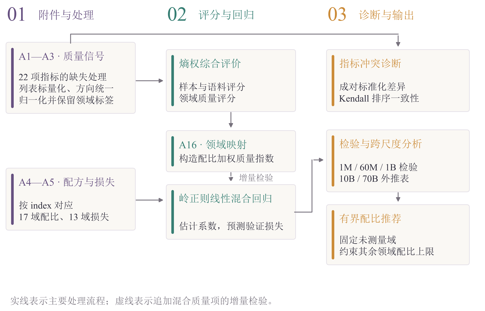
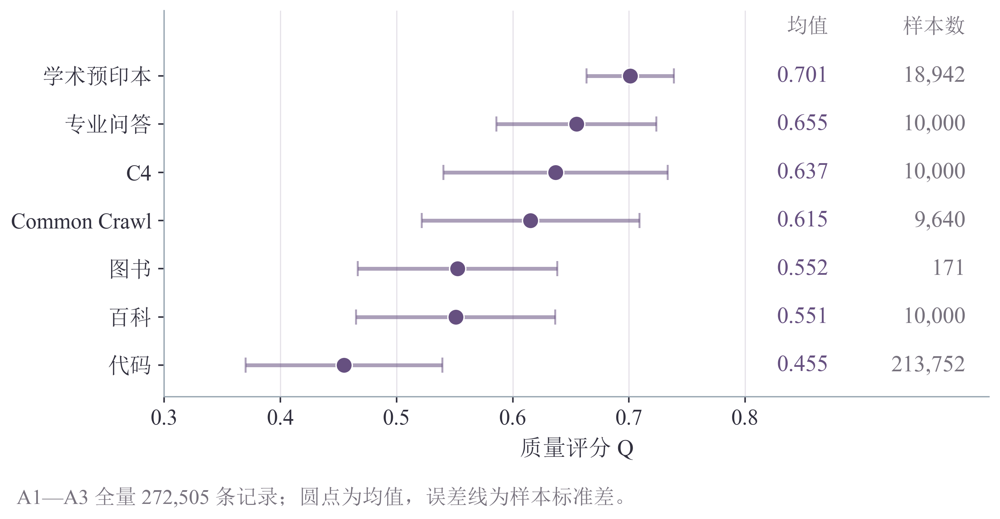
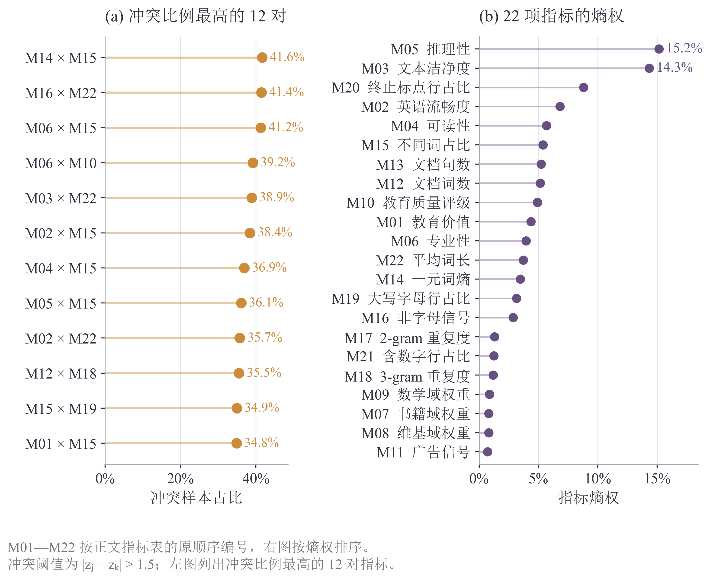
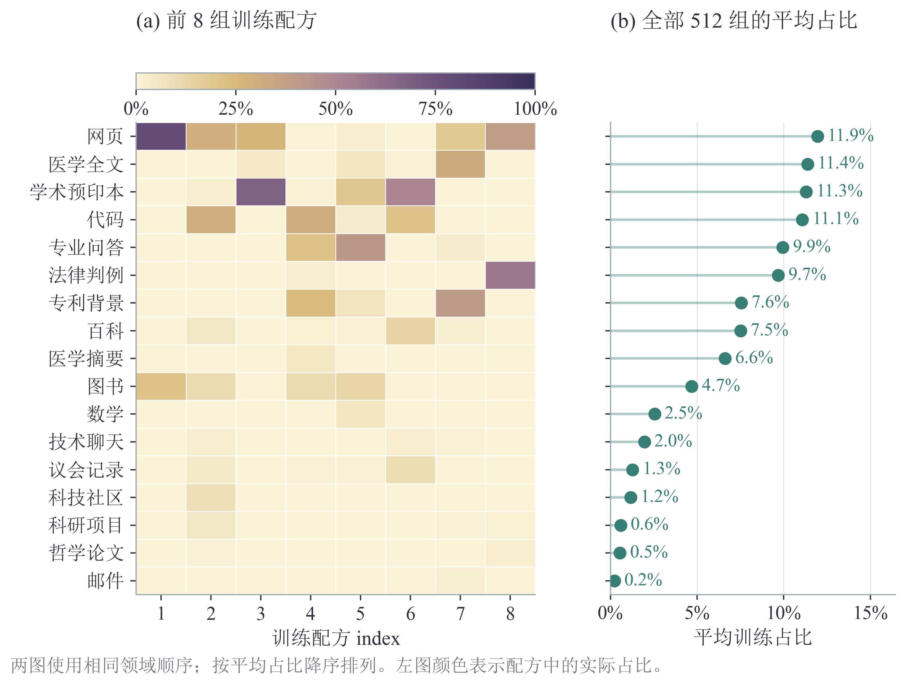
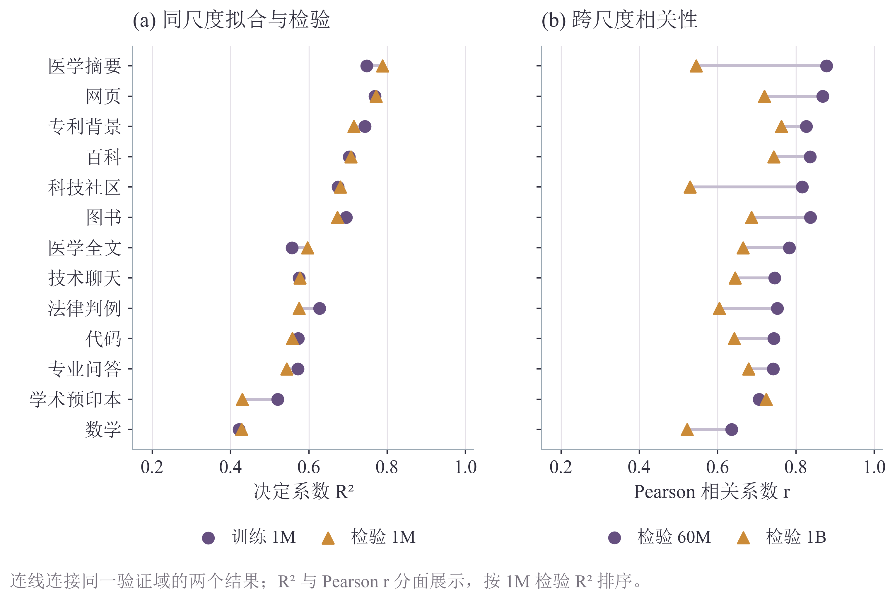
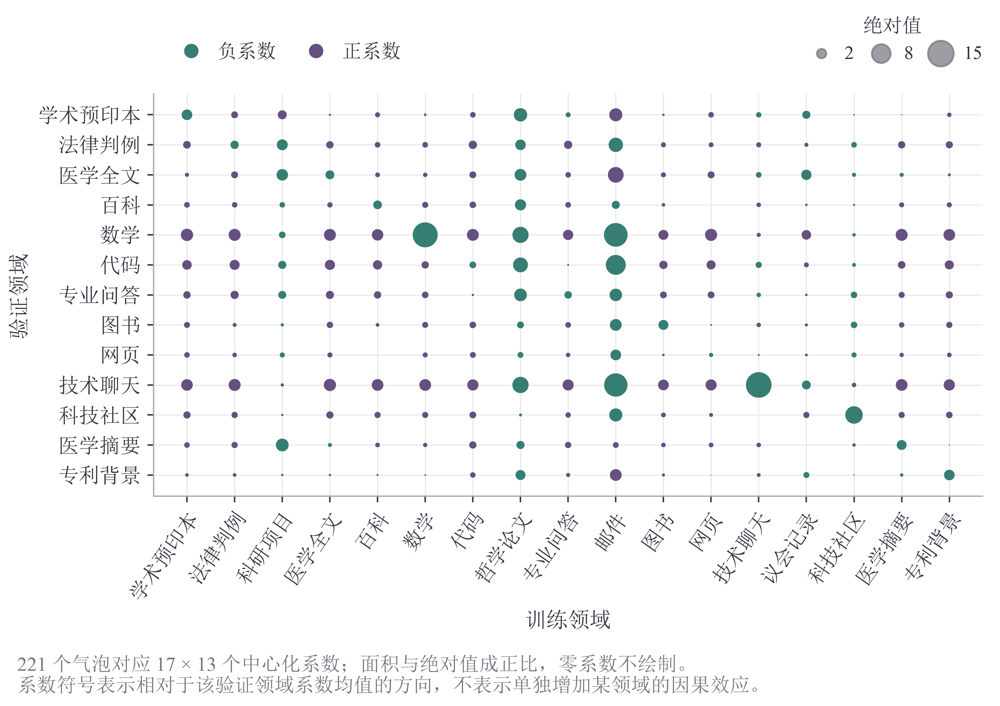
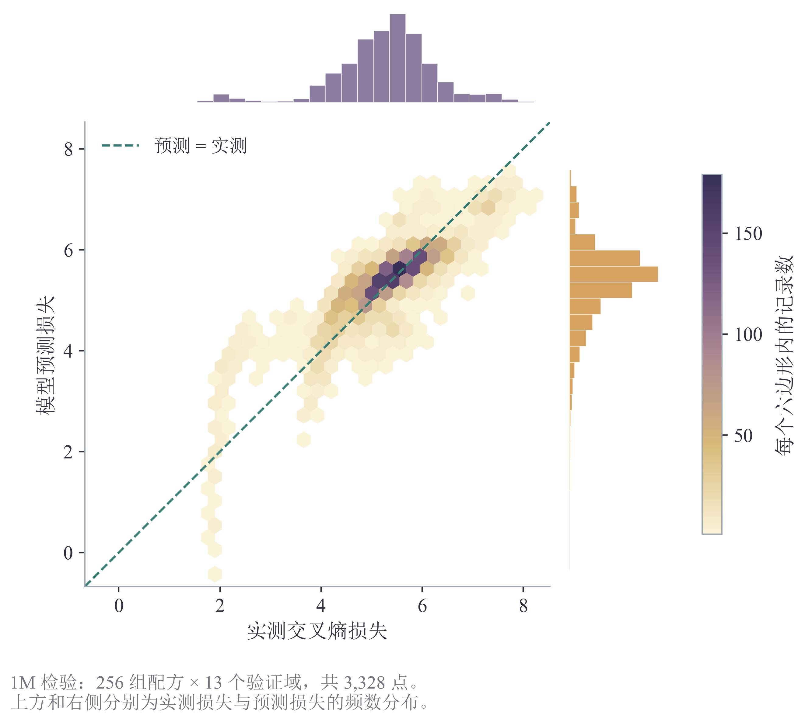
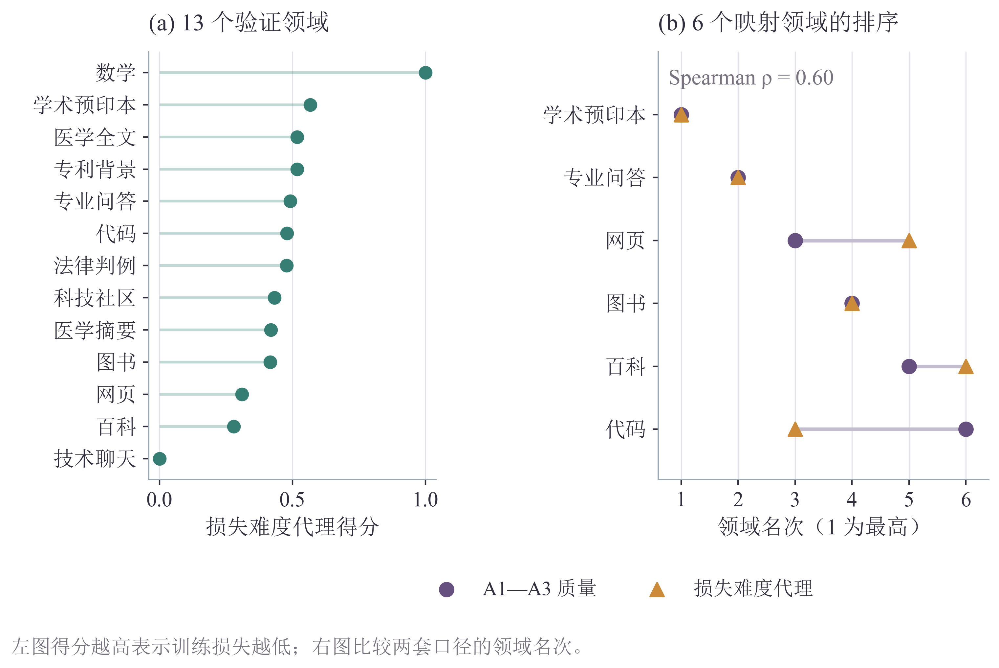
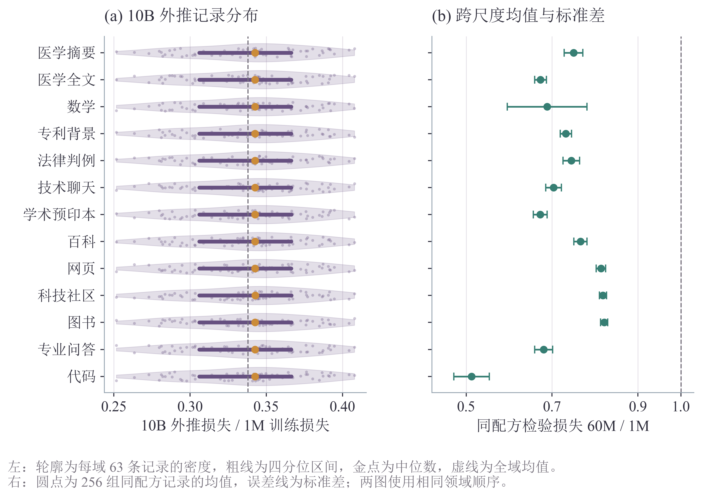

# 问题一图片预览

共 9 幅图，按正文顺序排列。参考 Q2、Q4 新版图片的紫、绿、金配色；原数据和模型保留。本页展示独立图片，论文 PDF 尚未重新编译。

## 图 2：质量评价与领域配比建模流程

## 图 3：领域质量均值与标准差

## 图 4：冲突指标对与熵权

## 图 5：训练配方结构

## 图 6：同尺度拟合与跨尺度相关性

## 图 7：中心化回归系数气泡矩阵

## 图 8：预测与实测损失的分布

## 图 9：损失难度代理与质量名次对照

## 图 10：外推分布与跨尺度损失比

绘图方式、数据来源、复现命令和待讨论的图文差异见 [图片重绘说明](问题一_图片重绘说明.md)。
